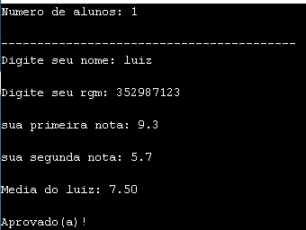
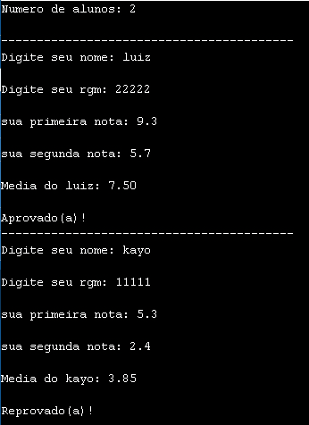

# Atividade_struct

## ❓ O que o programa faz ❓

> Este programa em linguagem C cadastra e avalia estudantes com base em duas notas.

> O programa pergunta quantos alunos serão cadastrados (máx. 50).

> Para cada aluno: Pede o nome e o RGM (matrícula).

> Solicita duas notas.

> Calcula a média das notas.

>Exibe se o aluno está Aprovado, em Recuperação ou Reprovado.

## 👨‍💻 Tecnologias e recursos utilizados

- 
- 
- Bibliotecas: <stdio.h>, <string.h>
- Conceitos aplicados: Estrutura (struct), Estruturas de controle (if, else if, else, for), Entrada e saída padrão (scanf, printf)

## ⚙️ Como Executar o código.
1. Abra o código no seu compilador C (Dev C++, Code::Blocks ou GDB Online).
     
2. Salve o código em um arquivo com nome, por exemplo:
```
estudantes.c
```
3. Compile o programa: 
```
gcc estudantes.c -o estudantes
```
4. Execute:
```
./estudantes
```
## 🧮 Exemplo de uso

<p align="center">  </p>
<p align="center">  </p>
